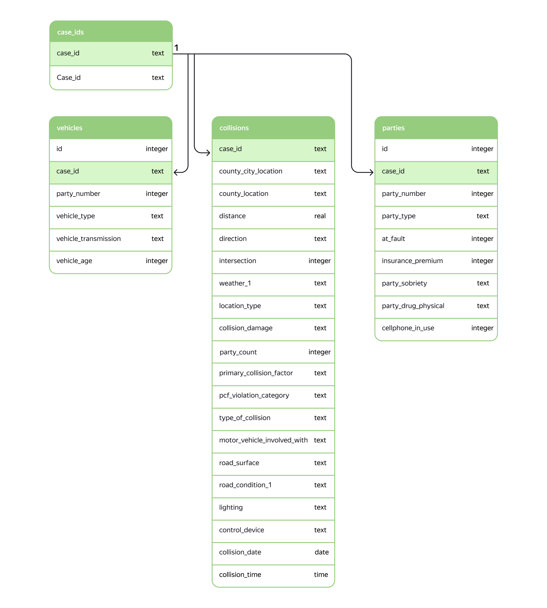

# Проект "Риск ДТП"

## Данные

Данные о ДТП представлены в БД:

## Задача

Для каршеринговой компании нужно создать систему, которая могла бы оценить риск ДТП по выбранному маршруту движения. Под риском понимается вероятность ДТП с любым повреждением транспортного средства. 

Как только водитель забронировал автомобиль, сел за руль и выбрал маршрут, система должна оценить уровень риска. Если уровень риска высок, водитель увидит предупреждение и рекомендации по маршруту.

## Используемые библиотеки
*numpy*, *pandas*,  *sklearn*, *seaborn*, *torch*, *sqlalchemy*, *tqdm*
